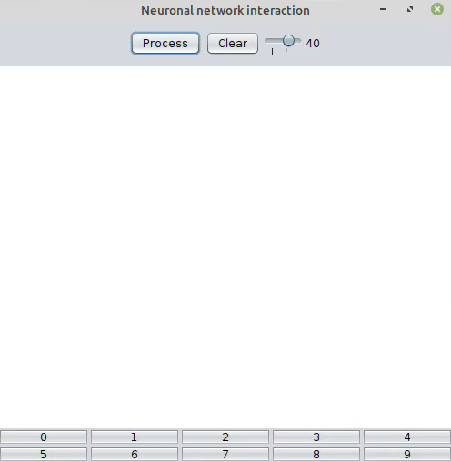
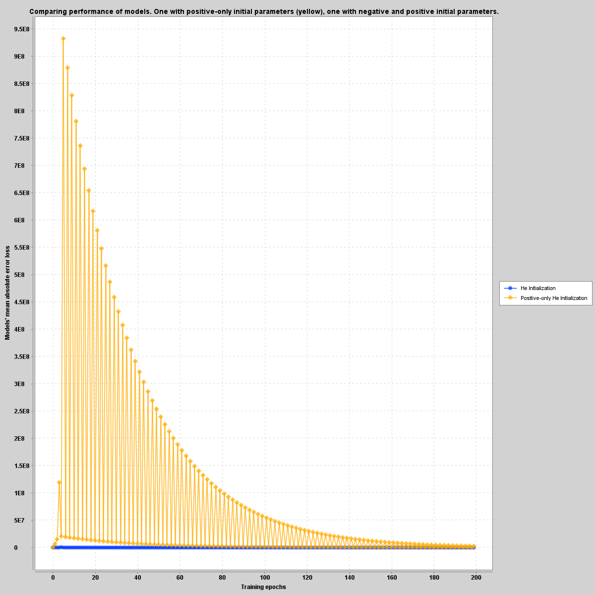
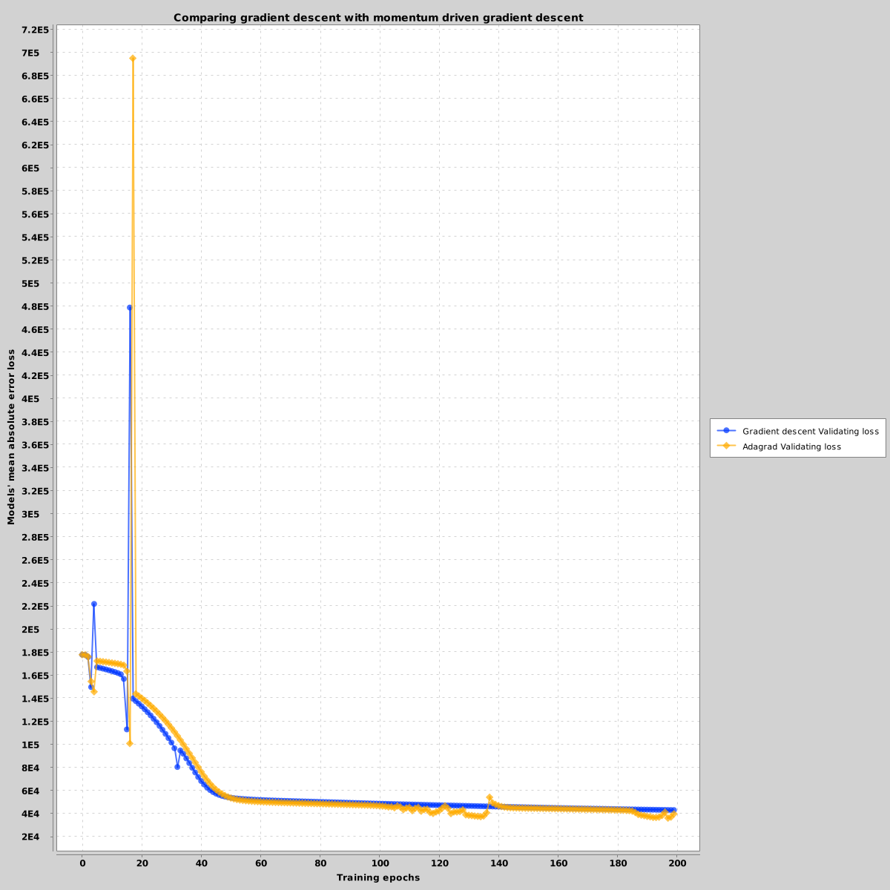
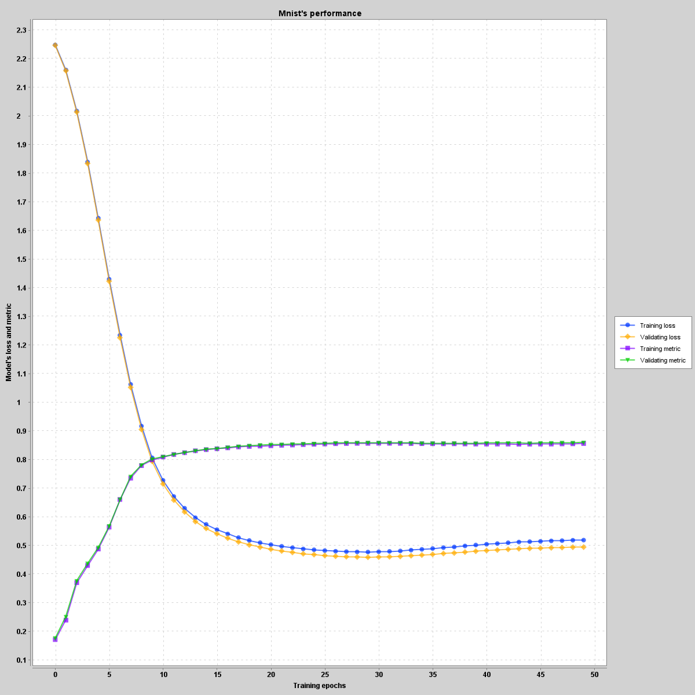
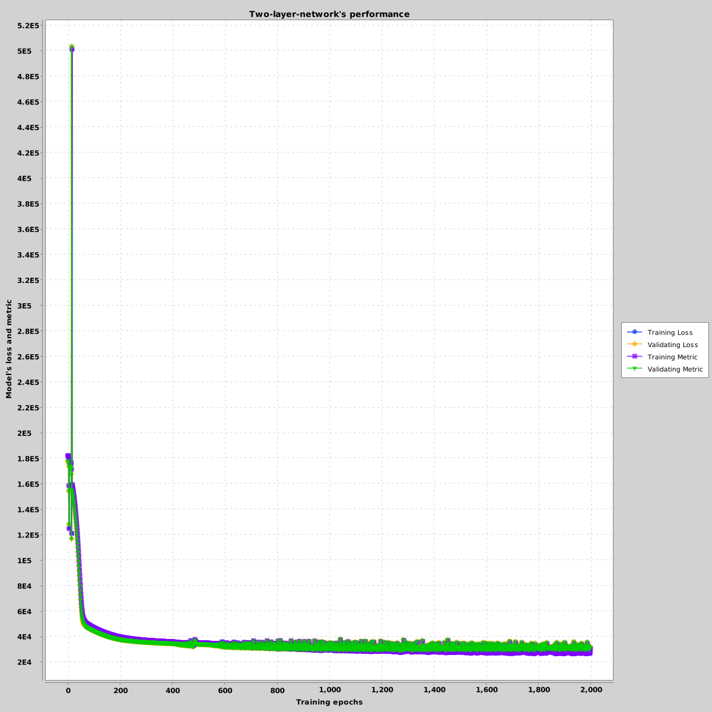

## Neural network and gradient-based optimization in Kotlin

Neural network is a statistical model where parameters can be updated with back propagation on a target. 
The implementation in this repository has been done with pure Kotlin, the backpropagation was done manually without 
any help of automatic differentiation framework like `Tensorflow`, `Pytorch` or `Deeplearning4j`. The topology of the network 
can be declared arbitrary and be used for any differentiable optimization problems.

    

The declaration can be simple like this. In this example we declare a simple neural network with 4 hidden layers, each 
will have its parameters initialized by the He initialization method. The output of each hidden layers will be scaled 
by the Rectifier Linear Unit. The measure the performance of the network after each training epoch, we use the Mean Absolute 
Error between the output and the groundtruth. 

```kotlin

val example = DeepNeuronalNetwork(
            intArrayOf(784, 128, 64, 32, 1),
            HeInitializer(),
            LeakyRelu(),
            NoActivation(),
            MAE(),
            MomentumGradientDescent(0.001),
            de.longuyen.neuronalnetwork.metrics.MAE())
```

To interact with a pretrained model, a GUI program was written so students can have an interactive learning experience. There 
are two pre-trained models. One for classification purpose and one for autoencoding purpose. 



##### Some implemented features

Following features are supported:

- [x] GUI application with Java Swing for interacting with MNIST dataset
- [x] Regression with MAE loss
- [x] Classification with sigmoid loss and cross entropy loss
- [x] Gradient descent optimization
- [x] Momentum driven gradient descent
- [x] Adagrad optimization
- [x] Adam optimization
- [x] RMSProp
- [x] Nestorov driven gradient descent

The implementation is made mostly for educational purpose to provide some insight into low level programming 
with neural network. For this purpose I implemented the whole network topology with Kotlin/Java. The performance is still not that good 
in comparision to the performance of a Tensorflow's model. But I hope to obtain a deeper understanding of neural network's optimization 
in my Master.

##### Dataset
- MNIST dataset for number classification
- Fashion-NIST dataset of Zalando Research for clothes classification
- Advanced Boston House Price dataset for price regression

---

## Experiments with the implementation

I made some experiments with the implemented neural network to take a better insight into how the model works. Following are some results
of the experiments which I find particularly interesting. 

##### Comparing positive only initialization with a combination of positive and negative weights

Initial parameters are very important for the performance of a model. An incorrect initialization can makes the gradients exploding
or vanishing, both are not good for converging.

 

Implementation of the correct initialization:

```kotlin
package de.longuyen.neuronalnetwork.initializers

import org.nd4j.linalg.api.buffer.DataType
import org.nd4j.linalg.api.ndarray.INDArray
import org.nd4j.linalg.factory.Nd4j
import java.io.Serializable
import kotlin.math.sqrt

class HeInitializer : Initializer(), Serializable {
    companion object {
        private const val serialVersionUID: Long = -1720018950602729088
    }

    override fun initialize(layers: IntArray): MutableMap<String, INDArray> {
        val weights = mutableMapOf<String, INDArray>()
        for (i in 1 until layers.size) {
            weights["W$i"] = (Nd4j.randn(*longArrayOf(layers[i].toLong(), layers[i - 1].toLong()))
                .mul(sqrt(2.0 / layers[i - 1].toDouble()))).castTo(DataType.DOUBLE)
            weights["b$i"] = Nd4j.zeros(*intArrayOf(layers[i], 1)).castTo(DataType.DOUBLE)
        }
        return weights
    }
}
```

Implementation of the positive-only initialization:

```kotlin
package de.longuyen.neuronalnetwork.initializers

import org.nd4j.linalg.api.buffer.DataType
import org.nd4j.linalg.api.ndarray.INDArray
import org.nd4j.linalg.factory.Nd4j
import java.io.Serializable
import kotlin.math.sqrt

class PositiveOnlyInitializer : Initializer(), Serializable {
    companion object {
        private const val serialVersionUID: Long = -1720018950602729088
    }

    override fun initialize(layers: IntArray): MutableMap<String, INDArray> {
        val weights = mutableMapOf<String, INDArray>()
        for (i in 1 until layers.size) {
            weights["W$i"] = (Nd4j.rand(*longArrayOf(layers[i].toLong(), layers[i - 1].toLong()))
                .mul(sqrt(2.0 / layers[i - 1].toDouble()))).castTo(DataType.DOUBLE)
            weights["b$i"] = Nd4j.zeros(*intArrayOf(layers[i], 1)).castTo(DataType.DOUBLE)
        }
        return weights
    }
}
```

##### Comparing gradient descent with momentum driven gradient descent

The same models are replicated, but the the training process is optimized by two different methods. The first one is the vanilla
gradient descent. The second one memorizes the velocity of past epochs and results into a better result. Both tested on the same data of the [House Price Dataset](https://www.kaggle.com/c/house-prices-advanced-regression-techniques).

The code for the comparision is simple:

```kotlin
val momentum = DeepNeuronalNetwork(
            intArrayOf(318, 128, 64, 32, 1),
            HeInitializer(),
            LeakyRelu(),
            NoActivation(),
            MAE(),
            MomentumGradientDescent(learningRate),
            de.longuyen.neuronalnetwork.metrics.MAE())

val vanilla = DeepNeuronalNetwork(
            intArrayOf(318, 128, 64, 32, 1),
            HeInitializer(),
            LeakyRelu(),
            NoActivation(),
            MAE(),
            GradientDescent(learningRate),
            de.longuyen.neuronalnetwork.metrics.MAE())

val housePriceData: SupervisedDataGenerator = HousePriceDataGenerator()
val X = trainingData.first.get(NDArrayIndex.interval(0, 318), NDArrayIndex.interval(0, 1000))
val Y = trainingData.second.get(NDArrayIndex.interval(0, 1), NDArrayIndex.interval(0, 1000))
val x = trainingData.first.get(NDArrayIndex.interval(0, 318), NDArrayIndex.interval(1000, 1460))
val y = trainingData.second.get(NDArrayIndex.interval(0, 1), NDArrayIndex.interval(1000, 1460))

momentum.train(X, Y, x, y, epochs = 150, batchSize = 32)
vanilla.train(X, Y, x, y, epochs = 150, batchSize = 32)
```

The architecture of both models are almost identical, except for the initial random generated weights. 
The momentum driven optimizer converges way faster on the house price dataset.



##### Performance evaluation for autoencoder

An autoencoder is a type of artificial neural network used to learn efficient data codings in an unsupervised manner.
The aim of an autoencoder is to learn a representation (encoding) for a set of data, typically for dimensionality reduction, 
by training the network to ignore signal “noise”. Along with the reduction side, a reconstructing side is learnt, where 
the autoencoder tries to generate from the reduced encoding a representation as close as possible to its original input, 
hence its name. Several variants exist to the basic model, with the aim of forcing the learned representations of the 
input to assume useful properties.

Examples are the regularized autoencoders (Sparse, Denoising and Contractive autoencoders), proven effective in learning
representations for subsequent classification tasks, and Variational autoencoders, with their recent applications as generative models.
Autoencoders are effectively used for solving many applied problems, from face recognition to acquiring the semantic meaning of words.


```kotlin
val model = DeepNeuronalNetwork(
            intArrayOf(784, 512, 256, 256, 128, 256, 256, 512, 784),
            HeInitializer(),
            LeakyRelu(),
            NoActivation(),
            MAE(),
            Adam(0.0001),
            de.longuyen.neuronalnetwork.metrics.MAE())

val mnistData: SupervisedDataGenerator = MnistDataGenerator()
val trainingData = mnistData.getTrainingData()
val testingData = mnistData.getTestingDataWithLabels()
val X = trainingData.first
val x = testingData.first


model.train(X, X, x, x, epochs = 150, batchSize = 32)
```

##### Performance evaluation for classification

For classification purpose the output of the network will be scaled with a softmax function and the loss is calculated with the cross entropy 
between the ground truth and the output.

The main difference between MNIST and house price data set is how the last layer is scaled and how the cost is computed.

```kotlin
val model = DeepNeuronalNetwork(
            intArrayOf(784, 128, 64, 32, 10),
            HeInitializer(),
            LeakyRelu(),
            NoActivation(),
            CrossEntropy(),
            MomentumGradientDescent(learningRate),
            de.longuyen.neuronalnetwork.metrics.Accuracy())

val mnistData: SupervisedDataGenerator = MnistDataGenerator()
val trainingData = mnistData.getTrainingData()
val testingData = mnistData.getTestingDataWithLabels()
val X = trainingData.first
val Y = trainingData.second
val x = testingData.first
val y = testingData.second


model.train(X, Y, x, y, epochs = 150, batchSize = 32)
```



##### Performance evaluation for regression purpose

The performance validation of the neural network was made on the advanced [House Price Dataset](https://www.kaggle.com/c/house-prices-advanced-regression-techniques).
For the training purpose, the data of the dataset has to be processed. Each discrete column will be one-hot-encoded and each continuous-valued column will be 
scaled to `[0, 1]`.

The structure of the model in Kotlin and the training look like following

```kotlin
val model = DeepNeuronalNetwork(
            intArrayOf(318, 128, 64, 32, 1),
            HeInitializer(),
            LeakyRelu(),
            NoActivation(),
            MAE(),
            MomentumGradientDescent(learningRate),
            de.longuyen.neuronalnetwork.metrics.MAE())

val housePriceData: SupervisedDataGenerator = HousePriceDataGenerator()
val X = trainingData.first.get(NDArrayIndex.interval(0, 318), NDArrayIndex.interval(0, 1000))
val Y = trainingData.second.get(NDArrayIndex.interval(0, 1), NDArrayIndex.interval(0, 1000))
val x = trainingData.first.get(NDArrayIndex.interval(0, 318), NDArrayIndex.interval(1000, 1460))
val y = trainingData.second.get(NDArrayIndex.interval(0, 1), NDArrayIndex.interval(1000, 1460))

model.train(X, Y, x, y, epochs = 150, batchSize = 32)
```

The training takes place with momentum driven gradient descent, the graphic shows how the cost of the model 
decreases over time.



## Notes
- If you want to test the code on your local computer. Run `git clone --depth=1 https://github.com/longuyen97/kotlin-neuronal-network` to avoid 
cloning everything you don't need. The git repository of this project contains very much useless data.
- Run `mvn clean package` and run `java -jar target/network-jar-with-dependencies.jar` to interact with the GUI application
and a pre-trained MNIST model.
